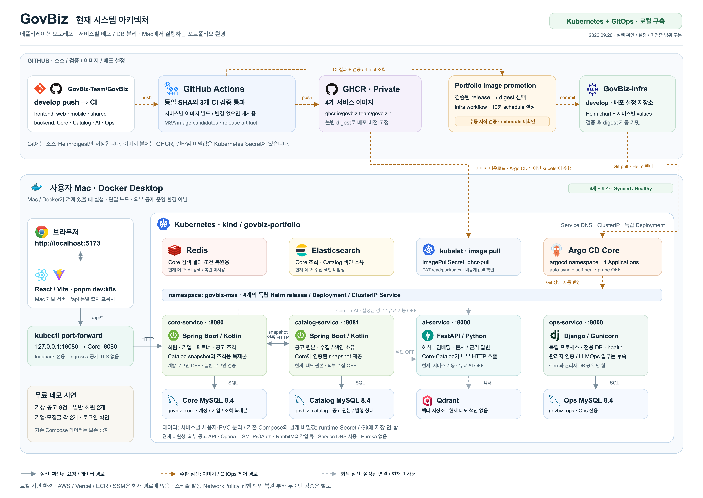
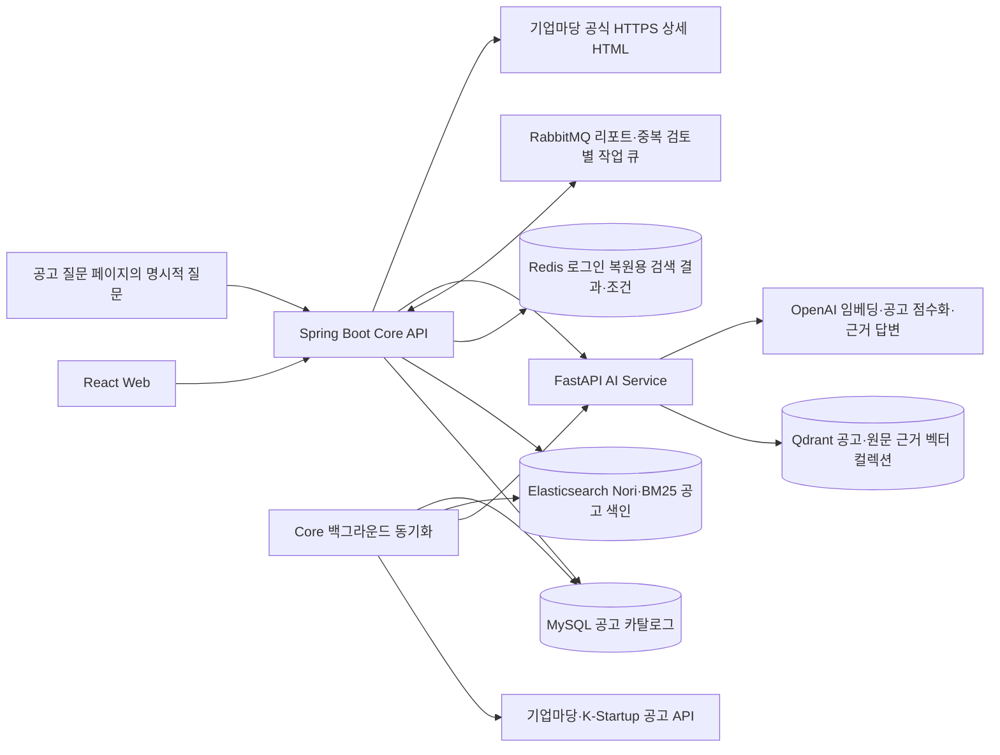

# GovBiz 아키텍처와 디자인 패턴

> 현재는 Mac의 portfolio Kubernetes 환경에서 시연합니다. 클라우드 운영 환경은 없으며 AWS/Vercel 배포 이력은 과거 참고 자료입니다. 현재 실행·미검증 범위와 과거 구성을 구분합니다.

[메인 README](../../README.md) · [문서 목록](../README.md) · [기술 스택](../technology.md)

이 문서는 서비스별 코드 구조, 계층의 책임, 의존성 주입과 디자인 패턴을 설명합니다.
검색·동기화·RAG가 실제로 호출되는 순서는 [서비스 호출·데이터 흐름](../architecture.md),
개발 완료 범위와 다음 작업은 [구현 현황](../implementation-status.md)에서 관리합니다.

## 읽는 순서

- [Frontend](#frontend-화면과-데이터-처리-분리): 클린 아키텍처의 의존 방향, DI, MVVM과 Redux
- [Core API](#core-api-업무-흐름과-외부-경계): 기능 중심 계층, Facade, MyBatis 경계
- [AI Service](#ai-service-기능별-모듈과-객체-조립): 구체 클래스, typed Agent, 객체 조립

## 시스템 구성



현재 웹은 Mac Vite → loopback port-forward → Kubernetes Core로 연결됩니다.
Core·Catalog·AI·Ops의 독립 배포·DB 소유권, 비공개 GHCR과 Argo CD 경로는
[현재 구성도 해설](../assets/architecture/README-kubernetes.md)에 정리했습니다.
promotion의 10분 schedule 실제 발동과 운영 안정성 전체 검증은 아직 완료로 표시하지 않습니다.

### 과거 AWS 구성과 단일 Core 업무 경로

기술 로고가 포함된 이미지는 [로컬 구성 기록](../assets/architecture/README.md#로컬-구성-기록),
[초기 배포 예정안](../assets/architecture/README-aws.md),
[Vercel + AWS 배포 구성](../assets/architecture/README-aws-deployed.md)으로 구분합니다.

과거 배포 구성은 `govbiz.vercel.app`의 `/api`를 서버 미들웨어·CloudFront VPC origin을 거쳐 비공개 EC2에 연결했습니다.
RDS·ECR·SSM·NAT·IGW와 CodeBuild 기반 백엔드 배포 경로도 표시합니다.
기존 배포 확인 기록과 저장소 설정을 반영했으며, 2026-09-16 작성 시 AWS 세션 만료로 실시간 상태는 재조회하지 못했습니다.

아래는 기존 embedded Core 모드의 업무 경로입니다. 현재 분리 모드에서는 수집·색인 소유자가 Catalog이고,
Mac 무료 시연에서는 외부 수집·유료 AI·작업 큐를 꺼 두었습니다. 전체 경로가 현재 실행 중이라는 뜻은 아닙니다.



사용자 요청의 진입점은 Core API입니다. 브라우저가 외부 공고 API나 AI Service를 직접 호출하지 않으며,
공공데이터포털 인증키와 OpenAI API 키는 서버에서 사용합니다. 공고 수집은 백그라운드에서 수행하고
사용자 검색은 이미 공개된 MySQL 카탈로그를 읽습니다.
Core는 현재 공고 버전으로 Elasticsearch 키워드 후보와 AI Service의 Qdrant 의미 후보를 제한하고,
RRF로 결합한 후보를 AI 점수화에 전달합니다. 동기화도 두 색인을 준비한 뒤 MySQL에 공개합니다.
MySQL이 원본이며 두 검색 색인은 파생 데이터입니다. 버전·준비 상태·오류 경계는
[Elasticsearch 적용 상세](../elasticsearch-lexical-search.md)를 참고하세요.
Redis는 비회원 검색의 전체 추천 결과·조건을 30분 보관하고 로그인 후 복원할 때 사용합니다.
첫 AI 검색의 캐시나 대화 기록·회원 세션 저장소로 사용하는 것은 아닙니다.
저장 구조·만료·계정 소유권·장애 처리는 [Redis 적용 상세](../redis-search-result-restoration.md)를 참고하세요.
정기 리포트 생성은 MySQL에 예산·작업 Outbox를 함께 저장한 뒤 RabbitMQ로 전달합니다. 소비자는 Core 내부에 있으며,
DB 상태 전이로 중복 실행을 막습니다. SMTP·수동 미리보기는 기존 경로입니다.
[RabbitMQ 적용 상세](../rabbitmq-daily-report-generation.md)는 transaction 경계와 재시도·실행 불명 처리를 설명합니다.
중복 지원·수혜 검토도 별도 큐와 Core 내부 소비자를 사용합니다. 실행 행 자체가 Outbox이며 HTTP 접수와
수집·파싱·AI 실행을 분리합니다. [중복 검토 비동기 흐름](../rabbitmq-combination-review.md)을 참고하세요.

## Frontend: 화면과 데이터 처리 분리

### 클린 아키텍처의 의존 방향

지원사업 검색·상세와 SampleItem은 Presentation, Domain, Data의 역할을 나눕니다. 클린 아키텍처에서
이 프로젝트가 적용한 핵심은 **업무 규칙이 외부 구현을 직접 참조하지 않도록 의존 방향을 정하는 것**입니다.

| 위치 | 역할 | 실제 예 |
|---|---|---|
| `presentation` | 화면 표시·사용자 동작·화면 상태 연결 | `ChatPage`, ViewModel Hook, `chatSlice` |
| `domain/entities` | 업무 데이터 | `SupportProgram` |
| `domain/usecases` | 사용자 기능 실행 | `SearchSupportProgramsUseCase` |
| `domain/repositories` | 데이터에 접근할 때 필요한 계약 | `SupportProgramRepository` interface |
| `data` | 계약 구현·HTTP 통신·외부 DTO 검증과 변환 | `SupportProgramRepositoryImpl`, `supportProgramApi` |
| `app` | 구현체 선택·객체 연결·앱 상태 구성 | Awilix 등록, Redux Store |

아래 두 화살표는 서로 다른 의미입니다. 실행 흐름은 실제로 어떤 메서드를 호출하는지,
코드 의존 방향은 어떤 계층의 타입·구현을 참조하는지 나타냅니다.

```text
실행 흐름: View → ViewModel → UseCase → Repository 구현 → HTTP API
핵심 의존: Presentation → Domain ← Data
객체 조립: App에서 Domain UseCase와 Data 구현체를 연결
```

[검색 UseCase](../../frontend/web/src/domain/usecases/SearchSupportProgramsUseCase.ts)는 Domain의 Repository
계약만 생성자로 받고 HTTP 함수를 직접 import하지 않습니다. 반대로
[Repository 구현](../../frontend/web/src/data/repositories/SupportProgramRepositoryImpl.ts)은 Domain interface를
구현하고, HTTP DTO를 `SupportProgram`으로 바꿉니다. API 형식 변경의 영향을 Data 경계에서 처리하고
UseCase 테스트에는 필요한 Repository 대역을 전달할 수 있습니다.

이 방향은 주요 업무 기능에 적용한 설계 원칙입니다. 모든 의존성이 엄격하게 격리된 전체 구조는 아닙니다.
Domain 계약에 요청 취소용 Web 표준 `AbortSignal`이 있고, ViewModel 또는 내부 Hook은 앱 컨테이너를 참조합니다.
단순 Health Hook은 별도 Domain UseCase 없이 등록된 외부 함수를 호출합니다.

### Awilix DI와 Service Locator

DI는 객체가 필요한 협력 객체를 스스로 만들지 않고 외부에서 받는 방식입니다. 검색 UseCase가
Repository 구현체를 직접 생성하지 않으므로 데이터 접근 구현과 객체 생성 책임을 분리할 수 있습니다.

[registerRepositories.ts](../../frontend/web/src/app/di/registerRepositories.ts)가 구체 구현체를 등록하고,
[registerUseCases.ts](../../frontend/web/src/app/di/registerUseCases.ts)의 factory가 Repository를 UseCase 생성자에
전달합니다. 두 역할의 인스턴스는 Awilix의 `singleton()`으로 앱 컨테이너 단위로 재사용합니다.
다음은 연결 코드의 핵심입니다.

```typescript
// app/di의 factory가 Repository를 UseCase 생성자에 전달
return new SearchSupportProgramsUseCase(supportProgramRepository)

// 내부 채팅 Hook의 기본 인수는 앱 컨테이너에서 UseCase 조회
appContainer.resolve('searchSupportProgramsUseCase')
```

첫 번째가 생성자 DI이고, 두 번째처럼 사용하는 곳에서 컨테이너를 조회하는 방식은 Service Locator입니다.
현재 Frontend는 두 방식을 함께 사용합니다. Hook 테스트는 선택적 인수에 `execute`를 제공하는 대역을
직접 전달하므로 운영 컨테이너를 바꿀 필요가 없습니다.

Awilix는 UseCase·Repository 등 **협력 객체**를 관리하고 Redux는 메시지·검색 진행 같은 **화면 상태**를
관리합니다. 서로 수명주기를 관리하는 대상이 다릅니다.

### Custom Hook을 ViewModel로 사용하는 MVVM

MVVM은 Model·View·ViewModel의 책임을 나누는 화면 설계입니다. 여기서 Model 측은 업무 데이터와
이를 조회·처리하는 Domain·UseCase·Repository이고, ViewModel은 화면에서 사용할 상태와 동작을 제공합니다.

| 역할 | 실제 코드 | 담당 작업 |
|---|---|---|
| View | [ChatPage.tsx](../../frontend/web/src/presentation/features/chat/view/ChatPage.tsx) | 입력창·결과 카드 렌더링, 사용자 이벤트 연결 |
| 페이지 ViewModel | [useChatPageViewModel.ts](../../frontend/web/src/presentation/features/chat/viewmodel/useChatPageViewModel.ts) | 채팅·준비 상태 조합, 검색 가능 여부 검사, IME·스크롤, 화면 이벤트 제공 |
| 내부 채팅 Hook | [useSupportProgramChat.ts](../../frontend/web/src/presentation/features/chat/hooks/useSupportProgramChat.ts) | `draft`, `messages`, `isSearching` 등 Redux 상태 구독과 검색·해석 요청의 시작·취소·시간 제한. 요청 객체 자체는 아래 요청 레지스트리가 소유 |
| 요청 레지스트리 | [chatRequestRegistry.ts](../../frontend/web/src/presentation/features/chat/state/chatRequestRegistry.ts) | 진행 중 `AbortController`·타이머의 주인. Store와 수명이 같아 화면을 떠나도 요청이 이어지고, thunk의 extraArgument로 주입 |
| 내부 준비 상태 Hook | [useSupportProgramSearchReadiness.ts](../../frontend/web/src/presentation/features/chat/hooks/useSupportProgramSearchReadiness.ts) | 검색 준비 상태 조회와 준비 중 polling 관리 |
| 공용 레이아웃 ViewModel | [useWorkspaceLayoutViewModel.ts](../../frontend/web/src/presentation/shared/app-sidebar/useWorkspaceLayoutViewModel.ts), [useWorkspaceChatActions.ts](../../frontend/web/src/presentation/shared/app-sidebar/useWorkspaceChatActions.ts) | 사이드바 접기·모바일 메뉴·포커스 이동과 새검색·대화 열기·삭제의 확인 대화상자 흐름. `WorkspaceLayout` View는 JSX와 문구만 가짐 |
| Model 측 | Domain 모델·UseCase·Repository | 검색 조건과 공고 데이터, 검색·상세 조회 실행 |

View는 페이지 ViewModel 하나가 반환한 상태를 렌더링하고 사용자 이벤트를 반환된 handler에 연결합니다.
페이지 ViewModel은 두 내부 Hook을 조합합니다. `submitMessage()`의 조건 해석은 준비 상태와 독립적이며,
제안 확인 검색·검색 재시도만 준비 상태를 검사합니다. 조회 실패 뒤 재확인 중에도 실제 성공 전까지 검색을 차단합니다.
채팅 Hook은 UseCase 실행과 요청 수명을 관리합니다. IME 조합·스크롤 DOM 참조와
포커스 제어도 페이지 ViewModel에 두되, 화면 전용 상태와 ref는 Redux가 아닌 Hook 로컬로 유지합니다.
View에는 JSX·스타일·ARIA 구조와 날짜·상태 문구 등의 순수 표시용 포맷만 남깁니다.

상세 조회·원문 근거 질문은 별도 `support-program-detail` feature에 둡니다.
[SupportProgramDetailPage.tsx](../../frontend/web/src/presentation/features/support-program-detail/view/SupportProgramDetailPage.tsx)는
`useSupportProgramDetailViewModel`을, 별도 질문 페이지인
[SupportProgramEvidenceQuestionPage.tsx](../../frontend/web/src/presentation/features/support-program-detail/view/SupportProgramEvidenceQuestionPage.tsx)는
`useSupportProgramEvidenceQuestionViewModel`을 사용합니다. 각 페이지의 View·스타일·ViewModel·테스트를
함께 배치하고, 채팅 feature의 화면 구현이나 상태에 의존하지 않습니다.
기업마당 상세의 **이 공고에 질문하기** 링크로 `/support-programs/detail/question`(사이드바 안에서는 `/app/support-programs/detail/question`)에 제공처·원본 ID를 전달합니다.
질문 페이지는 URL 식별자를 검증해 직접 접속·새로고침과 상세로 돌아가기를 지원하며, 명시적 질문 제출 때만 API를 호출합니다.
채팅은 상세 URL의 제공처·원본 공고 ID와 라우트 상태의 원래 검색 경로(`/` 또는 `/app/chat`)를 전달합니다.
상세·질문은 채팅의 ViewModel이나 Store를 조회하지 않고 허용된 복귀 경로만 왕복 전달합니다.
두 feature가 공유하는 오류 안내 문구는
`presentation/shared/support-program`에 두며 Domain·UseCase·Repository·DI 경계는 그대로 유지합니다.

### Redux Toolkit의 Flux 계열 단방향 흐름

Flux의 단방향 상태 흐름을 Redux의 Action·Reducer·Store·구독 구조로 적용했습니다.
MVVM은 화면의 책임 분리를, Flux 흐름은 상태 변경과 전달 순서를 설명하므로 두 패턴은 함께 사용됩니다.
Redux Store 자체를 Model 전체나 ViewModel 전체와 같은 것으로 취급하지 않습니다.

```text
ChatPage의 제출 이벤트
  → 페이지 ViewModel.handleSubmit → 내부 Hook.submitMessage
  → 조건 해석 요청 → 제안 또는 추가 질문 표시 (검색·조건 적용 없음)
사용자의 제안 확인 클릭
  → 페이지 ViewModel.handleConfirmInterpretation → 검색 준비 상태 확인
  → 내부 Hook.confirmInterpretation → dispatch(검색 Thunk)
      ├→ dispatch(searchStarted) → chat Reducer → pending 상태
      └→ await UseCase.execute(...)
          ├→ 성공: dispatch(searchSucceeded) → 결과·메시지 반영
          └→ 실패: dispatch(searchFailed) → 안전한 오류 상태
  → Store 변경 → 채팅 Hook의 useAppSelector 구독 → 페이지 ViewModel 반환값 → View 재렌더링
```

Thunk는 비동기 처리를 수행하는 함수이며, 검색·해석 Thunk는 내부 채팅 Hook 안에, 진행 중 요청을 끊는 취소 Thunk는
[chatRequestThunks.ts](../../frontend/web/src/presentation/features/chat/state/chatRequestThunks.ts)에 정의되어 Redux 미들웨어가 실행합니다.
HTTP 호출은 UseCase·Repository를 통해 수행하고 [chatSlice](../../frontend/web/src/presentation/features/chat/state/chatSlice.ts)의
Reducer에는 상태 변경 규칙을 둡니다. Slice 내부의 `state.messages.push(...)` 표기는 Redux Toolkit이
Immer로 처리하는 갱신 방식이며 View나 HTTP 코드가 Store 상태를 직접 변경하는 흐름이 아닙니다.

`main.tsx`의 Redux `Provider`가 Store를 화면 트리에 연결하고 Selector가 필요한 상태를 읽습니다.
요청 ID를 비교해 이전 요청의 늦은 결과를 무시합니다. 직렬화할 수 없는 `AbortController`와 타이머는 Store 상태가 아니라
Store를 만들 때 thunk extraArgument로 넣는 `ChatRequestRegistry`가 보관합니다. 화면 컴포넌트가 아니라 Store와 수명이 같으므로
다른 메뉴로 이동해도 요청이 끊기지 않고, 결과는 Redux로 돌아와 대화 기록의 상태 점·헤더 칩·도착 알림(`presentation/shared/chat-activity`)이
Selector로 읽어 보여 줍니다. 요청을 끊는 경우는 로그아웃(App 수준 `useChatRequestLifecycle`)·취소 버튼·시간 초과, 그리고
확인 대화상자에서 계속을 누른 새 대화·다른 대화 열기뿐입니다.

### Hook 상태와 Redux 상태의 선택

| 사용처 | 상태 저장 위치 | 수명 |
|---|---|---|
| 지원사업 채팅 | Redux `chat` slice + 내부 채팅 Hook + `ChatRequestRegistry` | 앱 내 화면 이동 동안 메시지·입력·진행 중 요청 유지, 아직 보지 않은 결과는 배지·알림으로 회수 |
| 지원사업 상세 | ViewModel Hook의 로컬 상태 | 화면 진입 때 API 재조회, 이탈 시 로컬 상태 해제 |
| 공고 원문 질문 | 질문 페이지 ViewModel Hook의 로컬 상태 | 명시적 제출 때만 API 호출, 화면 이탈·새로고침 시 질문·답변 초기화 |
| Hook SampleItem | React Hook Form + Hook 로컬 상태 | 화면 이탈 시 입력·결과 초기화 |
| Redux SampleItem | Redux `sampleItem` slice + ViewModel Hook | 앱 내 화면 이동 동안 입력·결과 유지 |

SampleItem의 두 버전 모두 같은 `PrepareSampleItemUseCase`와 API를 사용하며 ViewModel Hook이 있습니다.
비교 대상은 MVVM 적용 유무가 아니라 상태를 어느 곳에 보관하고 얼마나 유지하는가입니다.
현재 상태는 모두 메모리에 있으므로 브라우저 새로고침 시 초기화됩니다. 검색 요청에는 확인한 검색 의도와
기업 조건·접수 상태를 보냅니다. 해석은 확정 조건과 필요한 마지막 추가 질문·미확정 초안만 사용하며,
전체 대화 이력을 보내지 않습니다.

Zod가 HTTP 응답을 검증합니다. AbortController와 요청 ID는 새 대화·로그아웃 이후 오래된 결과가
반영되는 것을 막습니다. 화면 이탈만으로는 요청을 취소하지 않습니다. 이 취소 처리가 서버의 OpenAI 작업 중단까지 보장하는 것은 아닙니다.
상태 관리 비교용 SampleItem은 별도 예제 화면이며 지원사업 기능과 분리되어 있습니다.
Core 상태 조회와 두 SampleItem 요청에는 10초 상한을 적용합니다. 비동기 폼 검증 중 입력 수정·이탈은
요청 시작 전 세대 번호로 검사하며, 완료 후 늦은 응답은 요청 ID와 취소 상태로 차단합니다.

### 화면 데모와 실제 서비스 경계

로그인·세션·로그아웃과 라우트 보호(`RequireAuth`·`GuestOnly`·`PublicOnly`)는 Core API 세션에 연결되어 있습니다.
회원가입·파트너 모집·기업 프로필·관리자는 현재 로컬 예시 데이터와 입력을 가진 화면 데모입니다.
입력 검증이나 페이지 이동을 저장·전송 성공으로 표시하지 않습니다. 미연결 동작은 준비 중으로
비활성화하며, 실제 API가 없는 기능에 형식적인 UseCase·Repository 계층을 추가하지 않습니다.
로그인 전 화면은 `/` 아래 공개 경로를 공용 헤더와, 로그인 뒤 화면은 `/app` 아래 내부 경로를 사이드바와 함께 쓰며
공개 파트너 모집(`/partners`)은 읽기 전용 별도 feature입니다. 데모 화면의 서버 저장·권한 검사는 별도 출시 조건입니다.

공용 작업 레이아웃은 이름 있는 `workspace` 컨테이너를 제공하고 페이지는 실제 가용 너비에 따라 열을 접습니다.
페이지 내부 `column` 컨테이너는 각 카드·폼 열을 제어합니다. 사이드바가 차지하는 너비를 무시한 viewport
분기 때문에 본문이 49px로 좁아지는 문제를 막으며, 새 전역 레이아웃 상태나 JavaScript resize 구독은 추가하지 않습니다.
데스크톱 채팅의 내부 스크롤과 공개·모바일 화면의 문서 스크롤은 구분하여 처리합니다.

## Core API: 업무 흐름과 외부 경계

### 기능 중심 레이어드 아키텍처

Core API는 기능별 디렉터리 안에서 HTTP, 업무 흐름, 외부 통신, DB 접근의 계층을 구분합니다.
예를 들어 `supportprogram` 안에 Controller·Service·Facade·Client·Repository·Domain이 있습니다.

| 작업 | 기본 호출 방향 |
|---|---|
| 외부 API 호출 | Controller → Service → Facade → Client |
| MySQL 접근 | Controller → Service → Repository → MyBatis Mapper → Mapper XML → MySQL |
| 임시 검색 결과 저장·복원 | Controller → SupportProgramSearchPreviewService → SupportProgramSearchResultRepository → StringRedisTemplate → Lua → Redis |
| 상태 계산·공고 모델 | 프레임워크와 무관한 Domain |

Controller는 입력 검증과 공개 DTO 변환을, Service는 사용자 기능의 실행 순서를 맡습니다.
`SupportProgramSearchService`는 MySQL 공고 조회·접수 상태 필터·의미·키워드 결합 검색·점수화를 조합하고,
`SupportProgramStatusResolver` 같은 Domain 규칙은 프레임워크와 무관하게 상태를 계산합니다.

### Facade를 두는 이유와 실제 책임

Facade는 하위 시스템의 여러 처리 단계를 하나의 진입점으로 제공합니다. Client는 외부 HTTP를
담당하고, Facade는 그 결과가 업무에 사용할 수 있는지 검증하고 내부 모델로 돌려줍니다.
상위 Service가 외부 DTO 필드나 검증 절차를 매번 다루지 않도록 경계를 구성한 것입니다.

| Facade | 감추는 처리 | 상위 코드가 사용하는 결과 |
|---|---|---|
| `BizInfoSupportProgramCatalogFacade` | Client 전체 조회 → Mapper 정규화·검증 → 외부 예외 변환 | 검증된 카탈로그 목록 또는 카탈로그 예외 |
| `BizInfoSupportProgramSourceDocumentFacade` | 공식 상세 HTML 수집 → 읽기 가능한 원문 정규화 → 원문 수집 예외 변환 | 특정 기업마당 공고의 검증된 원문 |
| `AiSupportProgramRetrievalFacade` | 현재 공고의 두 색인 버전 참조 구성 → Elasticsearch 키워드·AI 의미 검색 응답 검증 → RRF 결합 | 현재 DB에 대응하는 최대 20개 공고 후보 |
| `AiSupportProgramRankingFacade` | AI DTO 생성 → Client 호출 → 버전·점수·자격·추천 이유 검증 | 추천 이유와 점수가 반영된 `SupportProgram` |
| `AiSupportProgramEvidenceFacade` | 원문 청크 색인·검색·답변 호출 → 청크·점수·인용 범위 검증 | 답변 상태와 공식 원문 인용 |

예를 들어 AI가 후보에 없는 ID나 잘못된 점수 합계를 반환하면
[점수화 Facade](../../backend/core-service/src/main/kotlin/ai/govbiz/core/supportprogram/facade/AiSupportProgramRankingFacade.kt)가
계약 위반으로 거부합니다. Service는 성공 결과를 받아 검색 응답을 만들고 잘못된 외부 응답 검증은 Facade에 맡깁니다.

모든 호출에 Facade를 추가하지는 않습니다. 상세 DB 조회는 Service가 Repository를 사용하고,
간단한 AI Health 호출과 색인 배치 요청은 Service가 Client를 직접 사용합니다. 업무 흐름의
트랜잭션·동기화 공개 순서도 Facade가 아니라 해당 Service·Repository의 책임입니다.
`SupportProgramIndexSyncService`도 구체 `ElasticsearchSupportProgramClient`와 `AiSupportProgramIndexClient`를
직접 호출합니다. 키워드 검색을 위해 전달만 하는 Facade나 범용 검색 provider 계층을 추가하지 않았습니다.

### Spring 생성자 DI와 계층의 적용 범위

Spring은 등록된 Bean을 다음과 같은 생성자에 전달합니다. `SupportProgramRankingFacade` 계약에는
현재 `AiSupportProgramRankingFacade` 구현체가 연결됩니다.

```kotlin
// SupportProgramSearchService의 생성자 선언 발췌
@Service
class SupportProgramSearchService(
    private val supportProgramRepository: SupportProgramRepository,
    private val rankingFacade: SupportProgramRankingFacade,
    private val retrievalFacade: AiSupportProgramRetrievalFacade,
) {
    // search()에서 주입받은 객체를 사용합니다.
}
```

외부 HTTP 설정과 `Clock`처럼 생성 설정이 필요한 객체는 Config의 `@Bean`에서 조립합니다.
이렇게 생성·연결을 분리하면 Service가 협력 객체를 직접 만들지 않아도 되고 테스트에서 대역을 전달할 수 있습니다.

Core의 Service에는 Spring annotation과 구체 Repository 의존성이 있습니다. 따라서 전체 Core는
기능 중심 레이어드 구조로 설명하며, 모든 외부 의존성을 Domain port로 역전시킨 엄격한 클린 아키텍처로
표현하지 않습니다. DI는 객체 전달 방법이고, 의존성 역전 원칙(DIP)은 코드가 어떤 계약에 의존하는지에
관한 원칙이므로 생성자 주입만으로 둘을 동일시하지 않습니다.

DB 행 타입인 `DbRow`는 MyBatis 경계에서만 사용하며 공개 응답이나 Domain 모델로 노출하지 않습니다.

공개 DTO, 외부 DTO, 예외, 설정은 이를 소유하는 기능 가까이에 둡니다. 정확한 디렉터리와 명명 규칙은
[아키텍처](../architecture.md), 실행·환경변수는 [Core API 안내](../../backend/core-service/README.md)를 참고하세요.

## AI Service: 기능별 모듈과 객체 조립

AI Service는 현재 기능에 필요한 구체 클래스와 직접 호출을 중심으로 구성합니다. 공통 기반은
`main.py`·`config.py`·`bootstrap.py`에, HTTP·업무 로직은 기능별 모듈에 둡니다.

| 위치 | 책임 |
|---|---|
| `app/main.py` | FastAPI 생성, 라우터 등록, 앱 상태에 컨테이너 연결, 종료 시 자원 해제 |
| `app/config.py` | 환경변수를 `Settings`로 읽고 필수 키·임베딩 설정 등 검증 |
| `app/bootstrap.py` | OpenAI·Qdrant Client, 모델, Agent, Service 생성·생성자 연결 |
| `app/health` | 내부 HTTP 상태 응답 |
| `app/support_program_index` | 문서 임베딩·색인·후보 검색의 Router, Models, Service |
| `app/support_program_ranking` | 후보 점수화의 Router, Models, Prompt, Agent, Service, Errors |
| `app/support_program_evidence` | 공식 원문 청크의 별도 색인·검색과 근거 답변 Router, Models, Service, Agent, Prompt, Errors |

[bootstrap.py](../../backend/ai-service/app/bootstrap.py)는 객체를 조립하는 곳입니다. 하나의 OpenAI Client를
모델 실행과 임베딩에 연결하고, Qdrant Client를 일반 공고 Index Service와 원문 Evidence Service에,
각각의 typed Agent를 점수화·근거 답변 Service에 생성자로 전달합니다. 이 객체들은
`ApplicationContainer`에 보관되고 앱 종료 시 Client 연결을 닫습니다.

[main.py](../../backend/ai-service/app/main.py)는 조립된 컨테이너를 `app.state.container`에 연결합니다.
Router의 `Depends` 함수는 여기서 해당 Service를 꺼내 endpoint에 전달합니다. 별도의 DI 라이브러리나
범용 registry 없이 명시적인 객체 생성·생성자 주입과 FastAPI의 요청 의존성 연결을 사용합니다.

### 점수화 모듈의 책임 분리

```text
HTTP API → Router → Ranking Service → Recommendation Agent → LangChain → OpenAI
                         ↑                     ↓
                         └── 구조화된 출력 ─────┘
                         ↓
              후보 검증·정렬·기준 적용 → Response
```

`router.py`는 HTTP 요청·응답과 안전한 오류 변환을, `models.py`는 Pydantic 요청·출력 스키마와
점수 합계 등의 불변식을 담당합니다. `prompt.py`는 LLM에 전달할 평가 지시를 담고, `agent.py`는
LangChain 프롬프트 체인 실행·제한시간·모델 오류 처리를 맡습니다. `service.py`는 모든 후보가 빠짐없이 점수화되었는지
검증하고 `2 × (의미 관련성 + 지원 유형 관련성)`으로 관련도를 계산한 뒤 정렬·의미 최소 기준·자격 필터를 적용합니다.
v5에서는 자격 `UNKNOWN`을 관련도와 분리해 확인 필요로 표시하며, MATCH를 무조건 앞세우지 않습니다.

프롬프트에 올바르게 답하라고 지시하는 것과 코드에서 결과를 검사하는 역할을 분리했습니다.
예를 들어 모델이 전달받지 않은 공고 ID를 반환하면 Service가 거부하고 Router가 안전한 오류로 변환합니다.
정상 결과도 Core API에서 다시 계약 검증을 거칩니다.

### 색인·검색 모듈과의 차이

중복 지원 검토는 `Router → CombinationReviewService → CombinationReviewAgent → LangChain ChatOpenAI → OpenAI Responses API`를 사용합니다.
LangChain 메시지와 실행 객체는 Agent 내부에 두고 기존 Pydantic 결과를 Service에 반환합니다.
Service가 인용·사업쌍·단계를 검증하며, `bootstrap.py`가 모델과 제한 시간·재시도 설정을 연결합니다.
신청 문서도 LangChain을 사용하며, 도우미 자유 질문 분류는 Agents SDK를 유지합니다.

색인·검색은 `HTTP API → Router → Index Service → OpenAI 임베딩·Qdrant → Response` 흐름입니다.
`support_program_index/service.py`가 문서 버전 확인·임베딩 생성·Qdrant 저장·검색을 직접 수행합니다.
기업마당 수집이나 MySQL 조회는 Core가 맡으며 AI Service는 전달받은 문서·ID·해시를 사용합니다.

검색 관련 Agent는 조건 변경 해석·후보 점수화·원문 근거 답변용 세 개입니다. 임베딩과 벡터 검색을 별도 Agent로 구성하지 않았으며,
이 세 Agent는 tool·handoff·graph 없이 각 LangChain 체인에서 LLM을 한 번 호출합니다. 실행 설정은
[AI Service README](../../backend/ai-service/README.md), Agent 추가 기준과 테스트 배치는
[Agent 모듈 구조](../../backend/ai-service/docs/agent-structure.md)를 참고하세요.
